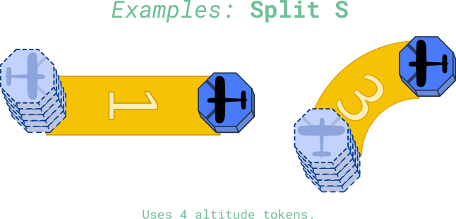

# Advanced Manoeuvres

These manoeuvres are for players already familiar with the core rules, or those who want to dive right in and become world famous fighter pilots!

## Split S

This rule prevents a pilot from being stuck when they are being tailed by an opponent.

- The Split S costs 4 altitude to execute.
- Turn the plane token 180° at the end of the manoeuvre.
- Players cannot perform a Split S and gain altitude in the same round.

You can read more about the Split S manoeuvre here:

<a href="https://en.m.wikipedia.org/wiki/Split_S" target="_blank" class="button">Split S Wiki</a>

Here is an excerpt:

"To execute a split S, the pilot half-rolls their aircraft inverted and executes a descending half-loop, resulting in level flight in the opposite direction at a lower altitude."

## Immelmann

This rule rewards aggressive tactics.

- This free manoeuvre that can only be performed immediatley after reducing another opponent's Health to 0.
- Do the following actions in order:
  - Gain 3 altitude tokens
  - Execute a straight
  - Turn your plane 180° (facing the opposite direction to the way they were).

You can read more about the Immelmann turn here:

<a href="https://en.m.wikipedia.org/wiki/Immelmann_turn" target="_blank" class="button">Immelmann Wiki</a>

Here is an excerpt:

"In modern aerobatics, an Immelmann turn (also known as a roll-off-the-top, or simply an Immelmann) is an aerobatic manoeuvre that results in level flight in the opposite direction at a higher altitude."

## Barrel Roll

This rule seperates the timid from the bold!

- During the manoeuvre phase a player may declare they are executing a Barrel Roll and execute either the 2 or 3 cost manoeuvre, but instead of orienting their plane along the new axis, their token will not rotate at all, and be traveling in the same direction.
- The manoeuvre cost is double the cost of whichever manoeuvre template the player is using (the straight now costs 2, the bank now costs 4).
- Players cannot perform a Barrel roll and gain altitude in the same round.

You can read more about the Barrel roll manoeuvre here:

<a href="https://en.wikipedia.org/wiki/Barrel_roll" target="_blank" class="button">Barrel Roll Wiki</a>

Here is an excerpt:

"A barrel roll is an aerial manoeuvre in which an airplane makes a complete rotation on both its longitudinal and lateral axes, causing it to follow a helical path, approximately maintaining its original direction."

## Dive Bomb

After a player has attacked a plane within range 1 **and** they have more altitude than the defender, they may attempt to perform a dive bomb manoeuvre:

- Remove altitude tokens from the attacker until they have the same number as the defender
- The attacker rolls a d6:
  - On a 2-6 result the defender suffers 1 damage
  - On a 1 result the attacker suffers 1 damage

You can read more about the Dive Bomb manoeuvre here:

<a href="https://en.wikipedia.org/wiki/Dive_bomber" target="_blank" class="button">Immelmann Wiki</a>

Here is an excerpt:

"A dive bomber is a bomber aircraft that dives directly at its targets in order to provide greater accuracy for the bomb it drops. Diving towards the target simplifies the bomb's trajectory and allows the pilot to keep visual contact throughout the bomb run."

Not to be confused with the Divebomb, the homicidal Decepticon.

## Pushing the Envelope

This rule rewards daring pilots who are willing to test the limits of the aircraft by going faster and higher than it should be possible!

A player may push the envelope during the manoeuvre stage and roll a d6:

- On a result of 5-6 they gain gain 1 extra Manoeuvrability for the turn or 1 extra altitude.
- On a result of 1-4, they lose 1 Health.
- The pilot may only "Push the envelope" only once per turn.

The flight envelope is a graph visualizing the capabilities of the aircraft in terms of min-max speeds and the altitude at which it can safely fly. The envelope itself is of course defined by various parameters and there is absolutely no way of simulating that in a board game. But, there is a term "Pushing the envelope", which means that the pilot tries to go over the speed or altitude defined by the flight envelope while risking the integrity of the aircraft (or causing the plane to stall).

<a href="https://en.wikipedia.org/wiki/Flight_envelope#%22Pushing_the_envelope%22" target="_blank" class="button">Immelmann Wiki</a>

## Special Rule - Ace Pilot

Earn your wings and keep the action moving!

- When a pilot destroys another plane, they become the Ace.
- For as long as they are the Ace, that pilot may reroll 1 Attack dice and 1 Defense dice each round.
- There can only be one Ace in the sky at a time.
